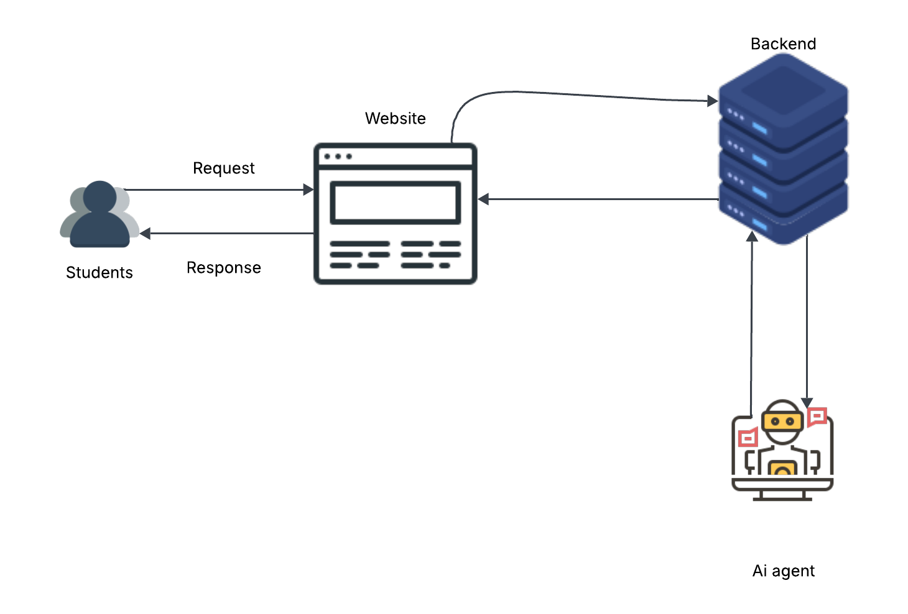

Always show details

Copy
# Create the README.md content based on the previous message
readme_content = """
# GenAI Architecture Overview

This document provides a conceptual overview of the GenAI (Generative AI) system architecture designed for student interaction and AI-powered content generation.

## Architecture Components

### 1. **Students**
- **Role:** End users of the system.
- **Action:** Submit queries or learning requests via the website interface.

### 2. **Website (Frontend)**
- **Role:** Acts as the primary user interface.
- **Functions:**
  - Accepts requests from students.
  - Sends these requests to the backend.
  - Displays responses received from the backend.

### 3. **Backend (Server)**
- **Role:** Core logic and orchestration layer.
- **Functions:**
  - Handles incoming requests from the frontend.
  - Communicates with the AI agent for intelligent responses.
  - Processes and formats data before sending it back to the frontend.

### 4. **AI Agent**
- **Role:** GenAI model (e.g., GPT, LLaMA, etc.) responsible for generating responses.
- **Functions:**
  - Receives prompts or data from the backend.
  - Generates relevant, human-like responses.
  - Sends results back to the backend for delivery.

## Request Flow

1. **Student → Website:** Students initiate a request via a web interface.
2. **Website → Backend:** The frontend sends the request to the backend.
3. **Backend → AI Agent:** The backend forwards the request for intelligent processing.
4. **AI Agent → Backend:** The AI generates a response and sends it back.
5. **Backend → Website:** The backend relays the AI-generated content.
6. **Website → Student:** The frontend displays the final response to the student.

## Use Case

This architecture is ideal for:
- AI tutoring platforms
- Educational chatbots
- Content generation tools
- Personalized student assistance systems

## Future Enhancements

- Add authentication and user tracking
- Integrate analytics for learning progress
- Incorporate voice-based interactions
- Enable support for multiple AI models